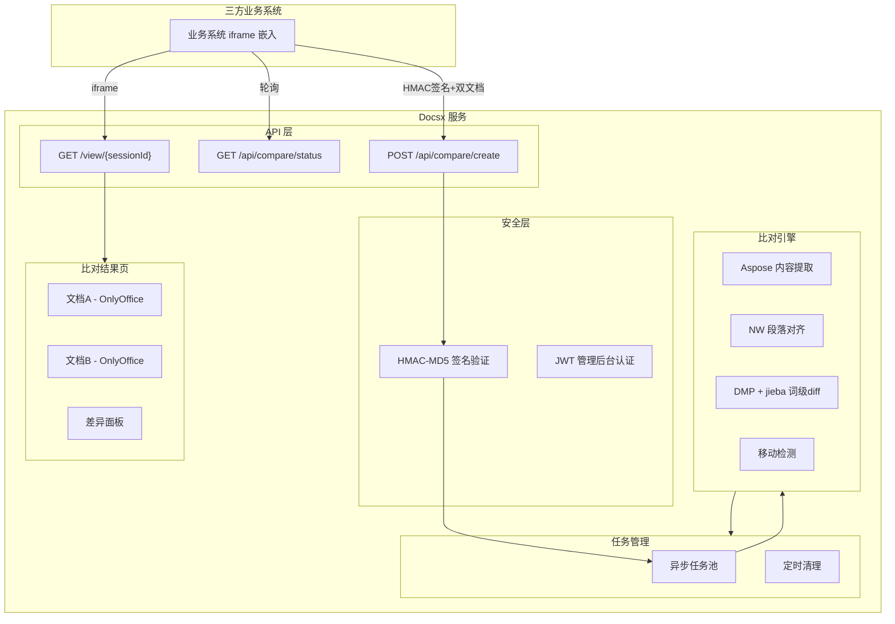
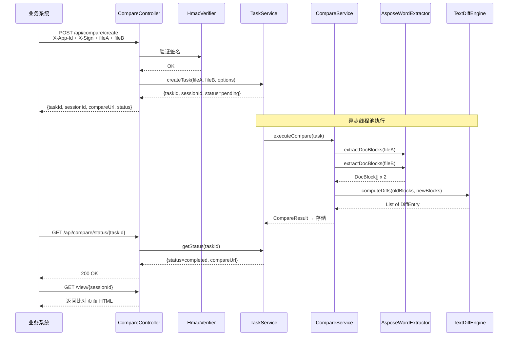
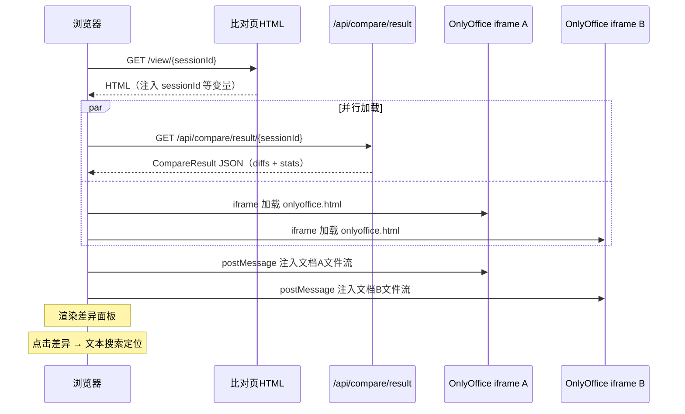

# Docsx 文档比对项目 — 完整实施规划

## 一、项目定位

Docsx 是一款**文档比对服务**，提供 API 供三方业务系统调用，返回可 iframe 嵌入的比对结果页面。

- 第一阶段：Word 比对（docx/doc）
- 第二阶段：PDF 比对
- 第三阶段：Excel 比对

---

## 二、技术选型

| 层次 | 技术 | 版本 | 说明 |
|------|------|------|------|
| 后端框架 | Spring Boot | 3.4.4 | 与 docsy 一致 |
| Java | JDK | 21 | LTS |
| ORM | MyBatis Plus | 3.5.9 | 与 docsy 一致 |
| 数据库 | SQLite + MySQL | 双模式 | 配置切换 |
| 文档提取 | Aspose.Words/PDF | 24.x | 来自 `E:\2025-3rd\filez-demo` 本地 |
| Diff 算法 | NW + DMP + jieba | - | 从 filez-demo 移植 |
| 前端管理后台 | Vue 3 + Element Plus | 3.5+ | 与 docsy 一致 |
| 文档预览 | OnlyOffice Personal WASM | 9.3 | fernfei/OnlyofficePersonal |
| 认证 | HMAC-MD5 + JWT | - | 三方签名 + 管理后台 JWT |
| 部署 | Docker + docker-compose | - | 多阶段构建 |

---

## 三、架构设计



---

## 四、比对结果页布局

参考 `filez-demo` 的 `comparePocResult.ftl` 布局，采用**左文档A + 右文档B + 最右差异面板**三栏布局：

```
+------------------------------------------------------------------+
| 返回 | 同步滚动 [x] | 对调 | ... | 相似度: 85.2%               |
+------------------+--------------------+--------------------------+
|                  |                    |  [全部|删除|新增|修改|移动] |
|  文档A            |  文档B             |  ┌──────────────────┐    |
|  (OnlyOffice     |  (OnlyOffice       |  │ [删除] 第3段      │    |
|   WASM iframe)   |   WASM iframe)     |  │  原文: xxx...    │    |
|                  |                    |  ├──────────────────┤    |
|                  |                    |  │ [新增] 第5段      │    |
|                  |                    |  │  新文: xxx...    │    |
|                  |                    |  ├──────────────────┤    |
|                  |                    │  │ [修改] 第8段      │    |
|                  |                    |  │  旧: xxx         │    |
|                  |                    |  │  新: xxx         │    |
|                  |                    |  └──────────────────┘    |
+------------------+--------------------+----------[>]-------------+
```

关键特性（从 filez-demo 继承）：
- 差异面板可展开/收起（CSS transition + class 切换）
- Tab 过滤：全部 / 删除 / 新增 / 修改 / 移动
- 点击差异卡片 → 双侧文档同步定位
- 同步滚动开关
- 文档对调按钮
- 段落级背景高亮 + 行内 mark 精细高亮

---

## 五、核心难点：Aspose 提取 与 OnlyOffice 段落定位

### 5.1 问题描述

- **Aspose** 在后端提取文档段落，产出 `DocBlock[]`（含 index、text、styleName 等）
- **OnlyOffice Personal WASM** 在前端渲染文档，其内部段落结构需与 Aspose 对应
- filez-demo 中使用的是 `docx-preview.js`（直接操作 DOM），映射相对简单
- OnlyOffice WASM 是独立渲染引擎，DOM 不可直接操作

### 5.2 解决方案（分层降级策略）

**第一层：尝试 OnlyOffice postMessage API**
- OnlyOffice Personal 支持 `postMessage` 协议（[文档](https://github.com/fernfei/OnlyofficePersonal/blob/9.3.0.133/docs/)）
- 需要验证是否支持：获取段落列表、文本搜索定位、文本高亮
- 如果支持 → 通过文本内容匹配建立 Aspose DocBlock.index → OO 段落的映射

**第二层：通过 onlyoffice-custom 补丁注入定位能力**
- 参考 docsy 的 `onlyoffice-custom/patches/` 机制
- 注入自定义 JS，监听 postMessage 指令，实现段落搜索和高亮

**第三层：纯文本搜索定位（兜底）**
- 利用 OnlyOffice 内置的文本搜索功能
- 差异面板点击时，将差异文本片段作为关键词搜索，自动定位到对应位置
- 高亮通过 CSS overlay 在 iframe 外层实现（参考 filez-demo 的 `diff-focus-overlay`）

**建议**：先用第三层方案跑通 MVP，再逐步探索第一、二层优化。

### 5.3 filez-demo 的映射逻辑（供参考移植）

来自 `comparePocResult.ftl` 的 `buildBlockToDomMap` 函数：
- 按文档顺序遍历 DocBlock 和 DOM 节点
- 精确匹配 → 去序号匹配 → 包含匹配 → 相似度匹配（阈值 0.5）
- 保持顺序一致性，搜索窗口 +/- 15

---

## 六、项目目录结构

```
docsx/
├── backend/                          # Spring Boot 后端
│   ├── pom.xml
│   └── src/main/
│       ├── java/com/docsx/
│       │   ├── DocsxApplication.java
│       │   ├── config/
│       │   │   ├── DocsxProperties.java       # 自定义配置属性
│       │   │   ├── DataSourceConfig.java      # SQLite/MySQL 双数据源
│       │   │   ├── MyBatisConfig.java
│       │   │   ├── WebConfig.java             # CORS、静态资源
│       │   │   ├── AsyncConfig.java           # 异步任务线程池
│       │   │   └── AsposeConfig.java          # Aspose License 加载
│       │   ├── security/
│       │   │   ├── SecurityConfig.java
│       │   │   ├── HmacVerifier.java          # HMAC-MD5 三方签名
│       │   │   ├── JwtUtils.java
│       │   │   └── JwtAuthenticationFilter.java
│       │   ├── controller/
│       │   │   ├── CompareController.java     # 核心：比对API
│       │   │   ├── ViewerController.java      # 比对结果页渲染
│       │   │   ├── TaskController.java        # 任务管理
│       │   │   ├── AppController.java         # 应用管理
│       │   │   ├── FontController.java        # 字体管理
│       │   │   ├── AuthController.java        # 登录
│       │   │   └── DashboardController.java   # 仪表盘
│       │   ├── service/
│       │   │   ├── CompareService.java        # 比对编排（移植自 DocCompareService）
│       │   │   ├── TaskService.java           # 任务池（异步执行+轮询状态）
│       │   │   ├── AppService.java
│       │   │   ├── FontService.java
│       │   │   └── AuthService.java
│       │   ├── engine/                        # 比对引擎核心（移植自 filez-demo）
│       │   │   ├── extractor/
│       │   │   │   ├── DocumentExtractor.java      # 提取接口
│       │   │   │   ├── AsposeWordExtractor.java    # 移植 DocExtractUtils
│       │   │   │   └── AsposePdfExtractor.java     # 预留
│       │   │   ├── diff/
│       │   │   │   ├── TextDiffEngine.java         # 移植 TextDiffUtils
│       │   │   │   ├── NeedlemanWunsch.java        # NW 对齐算法
│       │   │   │   └── InlineDiffProcessor.java    # DMP + jieba 行内diff
│       │   │   └── model/
│       │   │       ├── DocBlock.java               # 移植
│       │   │       ├── DiffEntry.java              # 移植
│       │   │       ├── DiffType.java               # 移植
│       │   │       ├── InlineDiff.java             # 移植
│       │   │       └── CompareResult.java          # 移植
│       │   ├── model/
│       │   │   ├── entity/
│       │   │   │   ├── App.java
│       │   │   │   ├── CompareTask.java
│       │   │   │   ├── Font.java
│       │   │   │   └── SysUser.java
│       │   │   └── dto/
│       │   │       ├── CompareRequest.java
│       │   │       ├── CompareResponse.java
│       │   │       ├── TaskStatusResponse.java
│       │   │       ├── R.java
│       │   │       └── LoginRequest.java
│       │   └── mapper/
│       │       ├── AppMapper.java
│       │       ├── CompareTaskMapper.java
│       │       ├── FontMapper.java
│       │       └── SysUserMapper.java
│       └── resources/
│           ├── application.yml
│           ├── application-sqlite.yml
│           ├── application-mysql.yml
│           ├── aspose-license.xml             # 从 filez-demo 复制
│           ├── jieba-user-dict.txt            # 从 filez-demo 复制
│           ├── schema-sqlite.sql
│           ├── schema-mysql.sql
│           └── templates/
│               ├── compare-viewer.html        # 比对结果页（Thymeleaf）
│               └── error.html
├── frontend/                         # Vue 3 管理后台
│   ├── package.json
│   ├── vite.config.ts
│   └── src/
│       ├── main.ts
│       ├── App.vue
│       ├── router/index.ts
│       ├── stores/user.ts
│       ├── utils/request.ts
│       ├── components/Layout.vue
│       └── views/
│           ├── login/index.vue
│           ├── dashboard/index.vue
│           ├── apps/index.vue           # 应用管理
│           ├── tasks/index.vue          # 任务池监控
│           ├── fonts/index.vue          # 字体管理
│           └── settings/index.vue       # 系统设置
├── onlyoffice/                       # OnlyOffice Personal 9.3 WASM
│   └── README.md                     # 说明：从 fernfei/OnlyofficePersonal 9.3 下载
├── onlyoffice-custom/                # OnlyOffice 定制补丁
│   ├── README.md
│   └── patches/
├── scripts/
│   └── setup-onlyoffice.sh           # 下载/部署 OnlyOffice 资源脚本
├── pom.xml                           # 父 POM
├── Dockerfile                        # 多阶段构建
├── docker-compose.yml
├── .gitignore
├── LICENSE
└── README.md
```

---

## 七、核心流程设计

### 7.1 三方调用（异步任务池模式）



### 7.2 比对结果页加载流程



---

## 八、API 设计

### 8.1 三方接口

| 方法 | 路径 | 说明 | 认证 |
|------|------|------|------|
| POST | `/api/compare/create` | 创建比对任务 | HMAC |
| GET | `/api/compare/status/{taskId}` | 查询任务状态 | HMAC |
| GET | `/api/compare/result/{sessionId}` | 获取比对结果数据 | Token/无（已验证会话） |
| GET | `/view/{sessionId}` | 比对结果页面 | 无（会话有效期内） |
| GET | `/api/compare/download/{sessionId}` | 下载文档文件流 | Token |

### 8.2 创建比对请求/响应

请求：
```
POST /api/compare/create
Headers: X-App-Id, X-Timestamp, X-Nonce, X-Sign
Body (multipart):
  fileA: (binary)
  fileB: (binary)
  request: {"docType":"word","callbackUrl":"https://..."}  (可选)
```

响应：
```json
{
  "code": 200,
  "data": {
    "taskId": "task_abc123",
    "sessionId": "sess_def456",
    "compareUrl": "/view/sess_def456",
    "status": "pending",
    "expiresAt": "2026-07-24 15:30:00"
  }
}
```

### 8.3 管理后台接口

| 方法 | 路径 | 说明 |
|------|------|------|
| POST | `/admin/api/auth/login` | 登录 |
| GET/POST/PUT/DELETE | `/admin/api/apps` | 应用 CRUD |
| GET | `/admin/api/tasks` | 任务列表（分页+过滤） |
| DELETE | `/admin/api/tasks/{id}` | 删除任务 |
| GET/POST/DELETE | `/admin/api/fonts` | 字体 CRUD |
| GET | `/admin/api/dashboard/stats` | 仪表盘统计 |
| GET/PUT | `/admin/api/settings` | 系统设置 |

---

## 九、数据库设计

```sql
-- 应用管理
CREATE TABLE app (
    id          BIGINT PRIMARY KEY AUTO_INCREMENT,
    app_id      VARCHAR(64) UNIQUE NOT NULL,
    app_name    VARCHAR(128) NOT NULL,
    app_secret  VARCHAR(128) NOT NULL,
    status      TINYINT DEFAULT 1,           -- 1启用 0禁用
    remark      VARCHAR(500),
    created_at  DATETIME DEFAULT CURRENT_TIMESTAMP,
    updated_at  DATETIME DEFAULT CURRENT_TIMESTAMP
);

-- 比对任务
CREATE TABLE compare_task (
    id           BIGINT PRIMARY KEY AUTO_INCREMENT,
    task_id      VARCHAR(64) UNIQUE NOT NULL,
    session_id   VARCHAR(64) UNIQUE NOT NULL,
    app_id       VARCHAR(64) NOT NULL,
    status       VARCHAR(20) DEFAULT 'pending',  -- pending/processing/completed/failed
    doc_type     VARCHAR(20) DEFAULT 'word',     -- word/pdf/excel
    file_a_name  VARCHAR(255),
    file_b_name  VARCHAR(255),
    file_a_path  VARCHAR(500),
    file_b_path  VARCHAR(500),
    result_json  LONGTEXT,                       -- CompareResult 序列化
    similarity   DECIMAL(5,4),
    error_msg    VARCHAR(1000),
    callback_url VARCHAR(500),
    expires_at   DATETIME,
    created_at   DATETIME DEFAULT CURRENT_TIMESTAMP,
    started_at   DATETIME,
    completed_at DATETIME
);

-- 字体管理
CREATE TABLE font (
    id          BIGINT PRIMARY KEY AUTO_INCREMENT,
    font_name   VARCHAR(128) NOT NULL,
    font_family VARCHAR(128),
    file_name   VARCHAR(255) NOT NULL,
    file_path   VARCHAR(500) NOT NULL,
    file_size   BIGINT,
    status      TINYINT DEFAULT 1,
    created_at  DATETIME DEFAULT CURRENT_TIMESTAMP
);

-- 系统用户
CREATE TABLE sys_user (
    id          BIGINT PRIMARY KEY AUTO_INCREMENT,
    username    VARCHAR(64) UNIQUE NOT NULL,
    password    VARCHAR(255) NOT NULL,
    nickname    VARCHAR(64),
    status      TINYINT DEFAULT 1,
    created_at  DATETIME DEFAULT CURRENT_TIMESTAMP
);

-- 系统设置
CREATE TABLE sys_setting (
    id          BIGINT PRIMARY KEY AUTO_INCREMENT,
    setting_key VARCHAR(128) UNIQUE NOT NULL,
    setting_val VARCHAR(2000),
    remark      VARCHAR(500)
);
```

---

## 十、比对引擎设计（移植 luoshu-server / luoshu-webresource 算法）

核心算法来源：
- `/opt/luoshu-webresource/src/webresource/infra/ai/` — 原 TypeScript 实现
- `/opt/luoshu-server/node_modules/ai-headless/` — 编译后的运行时包
- 移植为 Java 实现，保持算法逻辑和参数完全一致

### 10.1 算法架构（两阶段处理）

```
后端（重计算）                              前端（轻计算）
┌─────────────────────────────┐          ┌────────────────────────────────┐
│ 1. Aspose 提取 DocBlock[]    │          │ 1. 加载 preCompareData          │
│ 2. 过滤空段落/纯图片段落      │          │ 2. MODIFY 段落对 → segmentDiff  │
│ 3. 表格分流（TableAligner）   │   →→→   │    (jieba分词 + DMP 词级diff)    │
│ 4. NW 段落对齐               │          │ 3. 合并到 totalList              │
│ 5. 产出 preCompareData       │          │ 4. buildGroupedList 分组        │
│    (totalList + editList)    │          │ 5. 渲染差异面板 + 文档高亮       │
└─────────────────────────────┘          └────────────────────────────────┘
```

### 10.2 NW 段落对齐算法（Java 重写 diffEngine.ts:paragraphDiff）

**算法参数（与 luoshu 完全一致）：**

| 参数 | 值 | 含义 |
|------|-----|------|
| `NW_GAP_PENALTY` | -1.0 | 插入/删除一个段落的代价 |
| `NW_CHANGE_THRESHOLD` | 0.2 | LCS 相似度低于此值 → DELETE+ADD，否则 MODIFY |
| `nwMatchScore(sim)` | `sim - 0.5` | 匹配得分函数 |

**相似度计算：**
- `lcsLength(s1, s2) / max(len(s1), len(s2))`
- 文本先经 normalizeText（去空白/换行）
- 带二维缓存矩阵避免重复计算

**回溯分类规则：**

| 条件 | 操作 | editDistance 增量 |
|------|------|-----------------|
| `sim >= 1.0` | SAME（不输出） | 0 |
| `sim >= 0.2` | MODIFY | `1 - sim` |
| `sim < 0.2` | DELETE + ADD 两条 | 2 |
| gap（无匹配） | DELETE 或 ADD | 1 |

**输出结构（ParagraphDiffItem → Java 等价）：**

```java
public class ParagraphDiffItem {
    ContentOperation type;  // SAME, ADD, DELETE, MODIFY
    String text1, text2;    // 旧/新段落文本
    String id1, id2;        // 旧/新段落 ID
    Integer idx1, idx2;     // 在过滤后数组中的索引（用于前端连续性判断）
}
```

### 10.3 segmentDiff 词级 Diff（Java 重写 diffEngine.ts:segmentDiff）

**算法流程：**
1. `oldTokens = jiebaCut(oldText)`, `newTokens = jiebaCut(newText)`
2. linesToChars 技巧：每个 token 映射为 Unicode 字符 (0x0100+)
3. DMP `diff_main(encodedOld, encodedNew)` + `diff_cleanupSemantic`
4. 还原 token → 原始文本片段
5. 若无 EQUAL 片段 → 回退纯字符级 DMP
6. 相邻 DELETE+ADD 归并为 MODIFY
7. 输出 `SegmentDiffItem[]`（含 pos1/pos2 字符偏移）

**输出结构：**

```java
public class SegmentDiffItem {
    ContentOperation type;  // MODIFY, DELETE, ADD
    String text1, text2;
    Position pos1;  // { start, end } 在旧文本中的字符偏移
    Position pos2;  // { start, end } 在新文本中的字符偏移
}
```

### 10.4 表格分流比对（Java 重写 tableAlignPipeline.ts）

**匹配参数：**

| 参数 | 值 | 含义 |
|------|-----|------|
| `W_DIM` | 0.2 | 维度差异权重 |
| `W_HEADER` | 0.3 | 表头相似度权重 |
| `W_BODY` | 0.5 | 表体 Jaccard 权重 |
| `TABLE_MATCH_THRESHOLD` | 0.85 | 匈牙利匹配阈值 |

**流程：**
1. splitBlocks → 分离 tables 和 paragraphs
2. 匈牙利算法匹配表对（`hungarianMinCost`）
3. 匹配的表 → cell hash LCS 对齐 → 单元格内 paragraphDiff
4. 未匹配表 → 整体视为 ADD/DELETE
5. 剩余段落 → compareWordOnly

### 10.5 totalList 构建与 key 冲突处理

**key 格式：** `${pId1}_${pId2}`

| 操作类型 | totalList 行为 |
|----------|---------------|
| MODIFY | `totalList[key] = {}`（占位，前端 segmentDiff 后填充 `key_1`, `key_2`...） |
| ADD/DELETE | `totalList[key] = { type, pId1, pId2, text1, text2, idx1, idx2 }` |
| key 冲突（DELETE+ADD 同 key） | 追加 `_dup1`, `_dup2`... 后缀 |

### 10.6 文档提取层（Aspose）

从 `filez-demo` 的 `DocExtractUtils.java` 移植，保留：
- `doc.updateListLabels()` 确保列表编号
- 段落软回车拆分
- 表格整体拼接（用于表格分流比对）
- listLabel / styleName 提取

**额外适配：**
- 提取时同时输出 `DocBlock[]`（含 type='paragraph'|'table'）和 `paragraphs[]`（纯段落 id+content）
- 这与 luoshu 的 `getDocBlocks_ls19` 返回结构保持一致：`{ blocks, paragraphs }`

### 10.7 preCompareData 最终输出

```java
public class PreCompareResult {
    List<DocContents> doc1EditList;    // MODIFY 段落对（旧）
    List<DocContents> doc2EditList;    // MODIFY 段落对（新）
    Map<String, Object> totalList;    // 所有差异 KV 表
    double similarityScore;            // 0~1 全局相似度
    int editDistance;
    boolean allContentsCompared;
    int doc1ParagraphCount;
    int doc2ParagraphCount;
}
```

### 10.8 Java 依赖

| 库 | 用途 | 对应 luoshu 中的 |
|-----|------|----------------|
| `java-diff-utils` 或手写 DMP | 字符/词级 diff | `diff-match-patch` |
| `com.huaban:jieba-analysis` | 中文分词 | `jieba-wasm` / `@aspect/jieba` |
| Aspose.Words | 文档提取 | Writer SwServiceModule |
| `nanoid` 或 UUID | 段落 ID 生成 | `nanoid` |

---

## 十一、差异面板设计（移植 luoshu ComparePanel 逻辑）

### 11.1 差异面板核心功能

来源：`/opt/luoshu-webresource/src/webresource/app/compareDocPage/ComparePanel.tsx`

| 功能 | 说明 |
|------|------|
| 统计栏 | 显示全部/新增/删除/修改的**分组数**（非条目数） |
| Tab 过滤 | 全部 / 删除 / 新增 / 修改 / 移动 |
| 连续性分组 | 同类型 + 原文档相邻的 ADD/DELETE 合并为一个视觉组 |
| 修改类型字符级高亮 | MODIFY 条目内用 DMP 做字符级差异标注 |
| 点击定位 | 点击卡片 → 双侧文档同步滚动到对应位置 |
| 展开/收起 | 面板可收起为窄条（CSS transition） |

### 11.2 分组逻辑（buildGroupedList）

```
遍历 totalList 数组：
  对于 ADD 类型：
    向后扫描：同为 ADD 且 prev.idx2 + 1 === curr.idx2 → 合并入同一组
  对于 DELETE 类型：
    向后扫描：同为 DELETE 且 prev.idx1 + 1 === curr.idx1 → 合并入同一组
  对于 MODIFY 类型：
    每条独立成组
```

**连续性判断规则：**
- ADD 类型用 `idx2`（新文档索引）判断连续
- DELETE 类型用 `idx1`（旧文档索引）判断连续
- 只有原文档中**真正相邻**的同类型才合并，避免跨越 SAME 段落的错误分组
- 统计数量使用分组数（`groupedList.length`），而非原始条目数

### 11.3 修改类型字符级 Diff 渲染（renderModifyDiffContent）

```
对于每个 MODIFY 条目（含 text1 和 text2）：
  1. dmpInstance.diff_main(text1, text2, false)  // 纯字符级 DMP
  2. **不做任何 cleanup**（不调 cleanupSemantic/cleanupEfficiency）
     → 保留所有公共子串，即使只有 2 字符（如"架构"）
  3. 渲染两行：
     - 原文行：EQUAL 正常显示 + DELETE 标红删除线 (.diff-del)
     - 修改行：EQUAL 正常显示 + INSERT 标青 (.diff-add)
```

**关键设计决策（与 luoshu 完全一致）：**
- 差异面板的修改展示使用**独立的** DMP 实例
- 与后端/前端 segmentDiff 无关（segmentDiff 用分词级，面板用字符级）
- **不做 cleanup**：`cleanupEfficiency` 的 `Diff_EditCost=4` 会合并短公共子串，丢失精度

### 11.4 差异样式（CSS）

```css
/* 修改项内被删除的文字 */
.diff-del { color: #E8484E; background-color: #FFF2F0; }
/* 修改项内新增的文字 */
.diff-add { color: #00B8B8; background-color: #E6FFFB; }
```

结合 filez-demo 的高亮色系：
- 新增段落背景：`rgba(0,208,217,0.10)` 青色
- 删除段落背景：`rgba(253,63,71,0.12)` 红色 + 删除线
- 修改段落背景：`rgba(255,135,0,0.08)` 橙色
- 移动段落背景：`rgba(147,112,219,0.10)` 紫色

### 11.5 processCompareResults — 结果解析

```
遍历 preCompareData.totalList 的 key：
  若 value.type === 'add' → 加入 addList + totalList 数组
  若 value.type === 'delete' → 加入 deleteList + totalList 数组
  若 value 为空对象 {} → 这是 MODIFY 占位
    → 展开 key_1, key_2, key_3... 子条目
    → 每个子条目按 text1/text2 空值分类：
       - text1 非空 && text2 非空 → modify（字符级 diff）
       - text1 为空 → 段内新增
       - text2 为空 → 段内删除
```

### 11.6 卡片展开收起（与 filez-demo 一致）

```javascript
function toggleDiffPanel() {
    panel.classList.toggle('collapsed');
    // .collapsed { width: 0; min-width: 0; overflow: hidden; }
    // transition: width 0.3s, min-width 0.3s
}
```

---

## 十二、OnlyOffice 集成方案

### 12.1 资源部署

- 从 [fernfei/OnlyofficePersonal](https://github.com/fernfei/OnlyofficePersonal) 下载 9.3 版本
- 放置在项目 `onlyoffice/` 目录
- Spring Boot 通过 `WebConfig` 配置静态资源映射

### 12.2 集成方式

参考 OnlyOffice Personal 的 `onlyoffice.html` 集成协议：
- 比对页面左右各一个 iframe 嵌入 `onlyoffice.html`
- 通过 `postMessage` 将文档文件流注入 OnlyOffice
- 文档以只读模式打开（比对场景不需要编辑）

### 12.3 段落定位策略（MVP 阶段）

```javascript
// 点击差异卡片时的定位逻辑
function locateDiff(diffEntry) {
    // 1. 获取差异文本的前 20 个字符作为搜索关键词
    var keyword = diffEntry.oldBlock.text.substring(0, 20);
    // 2. 通过 OnlyOffice 的内置搜索功能定位
    postMessageToOO(iframeA, { type: 'search', text: keyword });
    // 3. 如果 OO 不支持搜索定位 → 降级为滚动到预估位置
}
```

### 12.4 定制化补丁（后续优化）

在 `onlyoffice-custom/patches/` 中可注入：
- 自定义搜索定位 API
- 段落高亮覆盖层
- 同步滚动回调

---

## 十三、前端比对页技术选型

比对结果页不使用 Vue SPA，而是 **Thymeleaf + 原生 JavaScript**（与 filez-demo 的 FreeMarker + jQuery 一致思路），原因：
- 比对页是独立页面，不需要复杂路由
- 需要精细控制 DOM 操作（高亮、滚动、映射）
- OnlyOffice iframe 通信需要原生 postMessage
- 无需引入打包工具，直接内联或引用静态 JS

可选方案（后续升级）：如果需要更好的组件化，可将比对页独立为一个 TypeScript 项目（`compare-page/`），用 Vite 打包为单个 bundle 供 Thymeleaf 引用。

---

## 十四、与 docsy/docsz 架构统一的模块

| 模块 | 功能 | 说明 |
|------|------|------|
| 应用管理 | App CRUD + Secret 生成 | 三方接入管理 |
| HMAC 签名 | `MD5(secret + "@@" + timestamp + "@@" + nonce)` | 与 docsy 认证方式一致 |
| 任务池 | 异步执行 + 状态轮询 + 过期清理 | 与 docsz 任务池思路一致 |
| 字体管理 | 上传/删除/列表 + 目录挂载 | 供 Aspose/OnlyOffice 使用 |
| 管理后台 | Vue 3 + Element Plus + JWT | 与 docsy 完全一致 |
| Docker 部署 | 多阶段构建 + 数据卷 | 与 docsy 一致 |

---

## 十五、配置设计

```yaml
# application.yml
server:
  port: ${SERVER_PORT:8080}

spring:
  profiles:
    active: ${DB_TYPE:sqlite}  # sqlite / mysql
  servlet:
    multipart:
      max-file-size: 200MB
      max-request-size: 400MB

docsx:
  data-dir: ${DOCSX_DATA_DIR:./data}
  file-store: ${DOCSX_FILE_STORE:./data/files}
  onlyoffice-path: ${DOCSX_ONLYOFFICE_PATH:classpath:/onlyoffice/}
  onlyoffice-custom-path: ${DOCSX_ONLYOFFICE_CUSTOM:classpath:/onlyoffice-custom/}
  jwt-secret: ${DOCSX_JWT_SECRET:docsx-dev-secret}
  task:
    thread-pool-size: 4
    expire-hours: 24
    max-file-size-mb: 100
  aspose:
    license-path: classpath:aspose-license.xml
    font-dir: ${DOCSX_FONT_DIR:./data/fonts}
```

---

## 十六、实施分阶段

### Phase 1：项目骨架 + 基础设施
- Maven 父子模块初始化
- Spring Boot 配置（双数据库、静态资源、Thymeleaf）
- 安全层（HMAC + JWT + SecurityConfig）
- 数据库 Schema + MyBatis Plus Mapper
- 管理后台 Vue 3 骨架

### Phase 2：比对引擎（移植 luoshu 算法 + filez-demo Aspose 提取）
- 数据模型：DocBlock / ParagraphDiffItem / SegmentDiffItem / CompareResult（Java 重写）
- Aspose 提取层：从 filez-demo 移植 DocExtractUtils，适配 luoshu 的 blocks+paragraphs 输出结构
- NW 段落对齐：Java 重写 diffEngine.ts 的 paragraphDiff（含 LCS 相似度、缓存矩阵、回溯分类）
- 表格分流比对：Java 重写 tableAlignPipeline（匈牙利匹配 + cell hash LCS）
- segmentDiff：Java 重写词级 diff（jieba 分词 + DMP linesToChars 技巧 + 字符级回退）
- totalList 构建：key 冲突处理、MODIFY 占位、editList 生成
- CompareService 编排层：Aspose 提取 → 过滤 → 表格分流 → NW → 产出 preCompareData
- 任务池（异步执行、状态管理、过期清理、轮询 API）

### Phase 3：API + 比对结果页
- CompareController（create/status/result/download）
- OnlyOffice WASM 集成（下载 9.3 资源、静态资源映射、postMessage 协议）
- 比对结果页 Thymeleaf 模板（左A + 右B + 最右差异面板三栏布局）
- 差异面板 JS：
  - processCompareResults（解析 totalList、展开 MODIFY 子项）
  - buildGroupedList（连续性分组：ADD 按 idx2、DELETE 按 idx1）
  - renderModifyDiffContent（独立 DMP 实例，不做 cleanup，字符级精确标注）
  - Tab 过滤、展开收起、卡片点击定位
- 前端 segmentDiff（可选：MODIFY 段落对在前端做词级 diff，或全部后端完成）
- 文档 A/B 加载 + postMessage 注入 + 同步滚动

### Phase 4：管理后台
- 应用管理 CRUD
- 任务池监控页面
- 字体管理
- 仪表盘统计
- 系统设置

### Phase 5：部署 + 优化
- Dockerfile（多阶段构建）
- docker-compose.yml
- OnlyOffice WASM 资源预压缩（gzip/brotli）
- 段落精确定位优化（探索 OO postMessage API 或注入补丁）

---

## 十七、已确认的技术决策

| 决策项 | 选择 | 来源 |
|--------|------|------|
| 比对算法 | 移植 luoshu NW+segmentDiff+表格分流（Java 重写） | 用户确认（WSL `/opt/luoshu-*`） |
| 数据库 | SQLite + MySQL 双模式 | 用户确认 |
| 任务执行 | 异步 + 轮询 | 用户确认 |
| Aspose 引入 | 本地已有（`E:\2025-3rd\filez-demo`），使用 Aspose Maven 仓库 | 用户确认 |
| 比对布局 | 左A + 右B + 最右差异面板（参考 filez-demo） | 用户确认 |
| 差异面板 | 分组合并 + 修改类型字符级 DMP 标注（移植 ComparePanel） | 用户确认 |
| OnlyOffice 定位 | 先验证 API，未确认前用搜索兜底 | 待验证 |
| 前端比对页 | Thymeleaf + 原生 JS（非 SPA） | 参考 filez-demo |
| 当前阶段 | 先写完整规划，不写代码 | 用户确认 |

---

## 十八、待验证/后续确认事项

1. **OnlyOffice Personal postMessage 协议验证**：需要实际测试其 API 是否支持段落级操作
2. **Aspose License 文件**：从 `E:\2025-3rd\filez-demo\src\main\resources\aspose-license.xml` 复制
3. **jieba 分词词典**：从 `E:\2025-3rd\filez-demo\src\main\resources\jieba-user-dict.txt` 复制
4. **PDF 比对**（Phase 2+）：从 filez-demo 的 `PdfCompareService` + `PdfExtractUtils` 移植
5. **Excel 比对**（Phase 3+）：需另行设计（Aspose.Cells 提取 + Sheet/Cell 级对齐）
