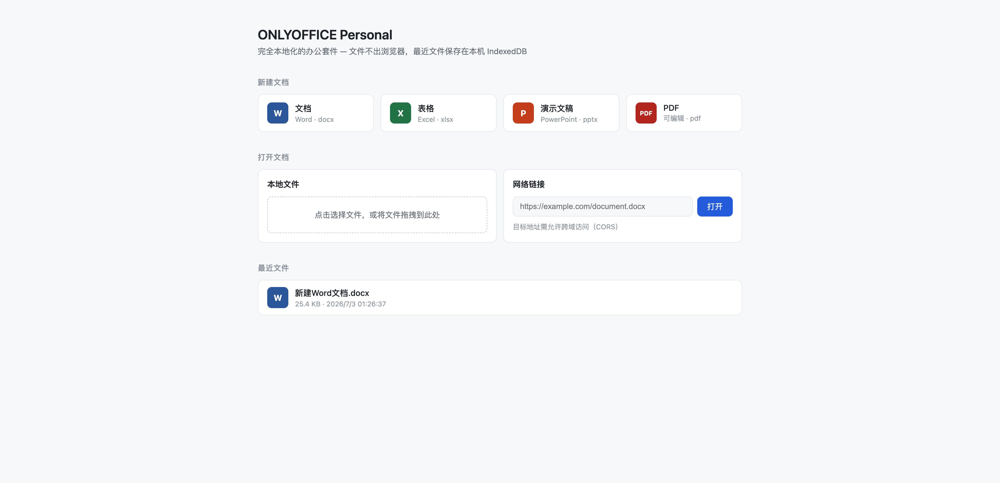
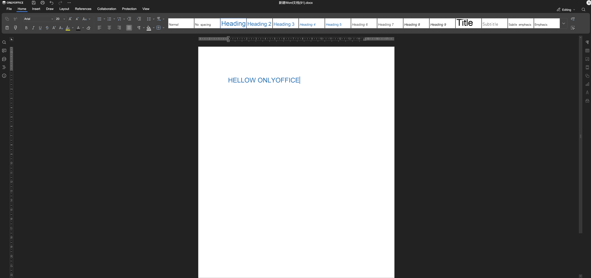
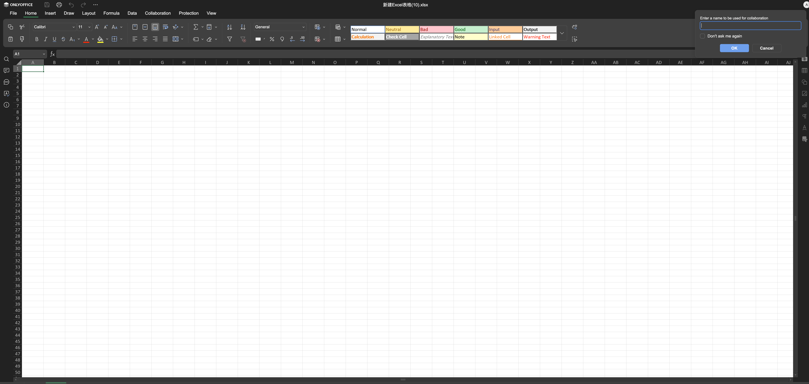
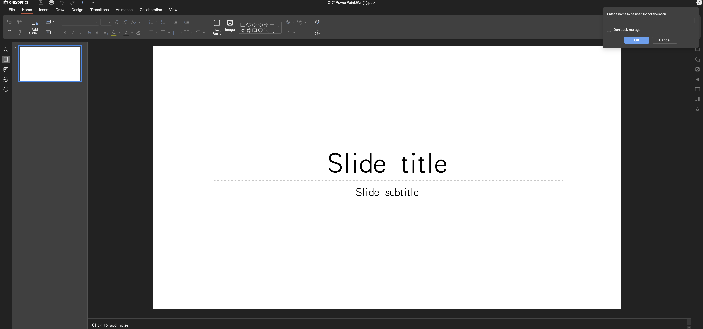
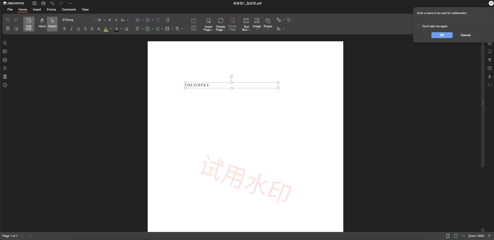

# ONLYOFFICE Personal

[](LICENSE)

在浏览器里跑的离线版 ONLYOFFICE。基于 `x2t.wasm` 做文档转换，不需要 Document Server，也不需要任何后端——打开一个静态页面就能编辑 Word、Excel、PPT 和 PDF，文件全程留在本地。

[English](README_EN.md) ｜ [在线体验](https://fernfei.github.io/office.html)



## 特点

- **无服务器**：文档的打开、编辑、导出都在浏览器内完成，不上传任何文件。
- **格式支持**：docx / xlsx / pptx 及对应的 ODF、CSV 等，PDF 支持注释、表单填写和文本编辑。
- **可集成**：`onlyoffice.html` 提供一套 postMessage 协议，能嵌进你自己的系统，取回编辑后的文件流。
- **纯静态**：任意静态服务器都能托管，也可以直接打包进前端工程。

基于 ONLYOFFICE 9.3 编译产物，**内置 `x2t.wasm` 已升级为最新的 9.4 版本**。

## 快速开始

在项目根目录起一个静态服务器，然后访问 `office.html`：

```bash
# Python
python -m http.server 8000

# 或 Node.js
npx http-server -p 8000

# 或 PHP
php -S localhost:8000
```

浏览器打开 <http://localhost:8000/office.html>。

`office.html` 是一个演示入口：新建文档、打开本地文件或网络链接、把最近文件存到浏览器 IndexedDB，编辑后可保存回本地或下载。它本身也是集成方式的完整示例。

## 界面

Word 文档



Excel 表格



PowerPoint 演示



PDF 编辑



## 集成到自己的系统

把仓库整体（`onlyoffice.html`、产物目录 `9.3.0.134-*`、`assets/`、`blank/`）放到前端工程的静态目录下，用 iframe 嵌入 `onlyoffice.html`，通过 postMessage 注入文档、取回文件流。

- **[使用文档](docs/使用文档.md)**：三种集成方式、docConfig 配置、消息协议、保存文件流、文件名与重命名、另存为、连接器（Automation API），以及一份 Vue 组件封装。
- **[文件流提取原理](docs/集成教程-文件流提取.md)**：离线版没有保存回调，这篇讲清楚字节是怎么从 `x2t.downloadFile` 里取出来的。
- **[部署优化 - 资源压缩](docs/部署优化-资源压缩.md)**：`x2t.wasm` 有 40M，预压缩 + 强缓存能把传输体积降到 6.6M（-84%），附 `precompress.sh` 用法和 Nginx 配置。

## 目录结构

```
OnlyofficePersonal/
├── 9.3.0.134-*/          # ONLYOFFICE 编译产物（web-apps / sdkjs / fonts）
├── assets/               # favicon、空白 PDF 等静态资源
├── blank/                # 新建文档用的空白模板
├── docs/                 # 文档与截图
├── office.html           # 演示入口（独立使用）
└── onlyoffice.html       # 集成入口（iframe + postMessage）
```

## 许可证

[AGPL-3.0](LICENSE)。ONLYOFFICE 相关组件版权归 [ONLYOFFICE](https://www.onlyoffice.com/) 所有。

## 交流

ONLYOFFICE 技术交流群：<https://qm.qq.com/q/hVJ1Wbv8Na>


